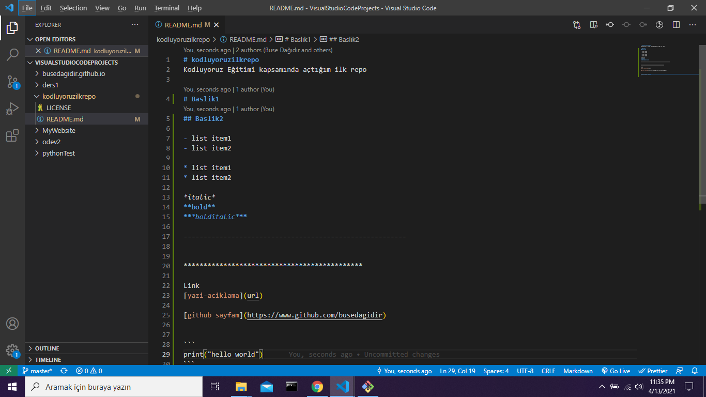

# kodluyoruzilkrepo
Kodluyoruz Eğitimi kapsamında açtığım ilk repo

# Baslik1
## Baslik2

- list item1
- list item2

* list item1
* list item2

*italic*
**bold**
***bolditalic***

--------------------------------------------------------



*********************************************

Link
[yazi-aciklama](url)

[github sayfam](https://www.github.com/busedagidir)


```
print("hello world")
```
